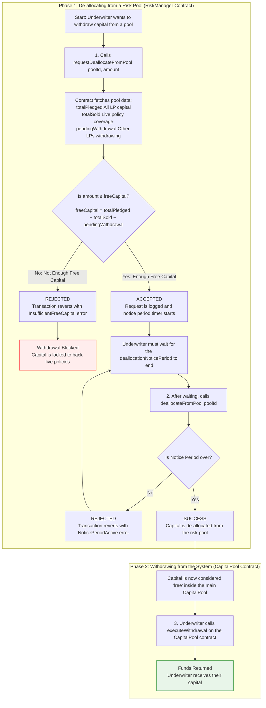
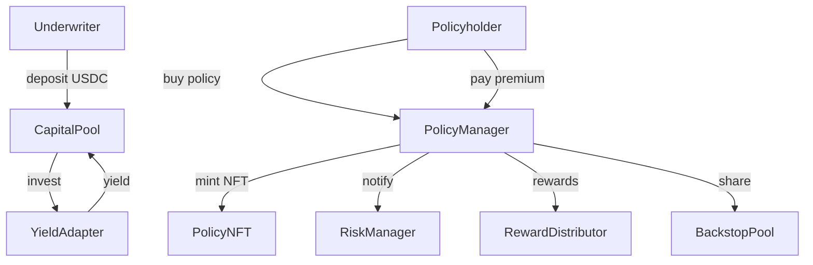

# CoverPool Contracts

Amplify Insurance is building a modular, open-source insurance marketplace where underwriters supply USDC liquidity, policy-holders buy cover on specific DeFi or real-world risks, and the whole life-cycle is enforced by Solidity smart-contracts. The code lives in a Hardhat monorepo; the `contracts/` package is the heart of the system, and all figures below refer to that codebase.

## Amplify Insurance’s on-chain cover protocol – high-level summary

### Core building blocks

- **CapitalPool** – a vault that accepts underwriter deposits, sends idle funds to external “yield adapters”, and keeps an accounting of profits, losses and withdrawal queues.
- **PolicyManager** – the single user-facing entry point: it mints an ERC-721 `PolicyNFT` for every policy sold, tracks premiums, and burns the NFT on expiry or claim.
- **RiskManager** – orchestrates the movement of funds between pools during allocations, premium collection and claim payouts, using the `LossDistributor` and `RewardDistributor` helpers for pro-rata maths.
- **PoolRegistry** – a registry where each “risk pool” lives with its utilisation-based premium curve, whitelist of accepted collateral and active yield adapter.

### Liquidity & premium flows

Underwriters deposit USDC → `CapitalPool` optionally stakes it in Aave, Compound, Euler, Moonwell or Morpho via plug-in adapters → yield flows back to the pool. When a policy-holder buys cover, `PolicyManager` pulls capital from the relevant risk pool, mints a `PolicyNFT` and streams premiums (block-by-block) back to underwriters. A small slice of every premium goes to the `BackstopPool` – a catastrophe back-stop fund issued as `CatShare` ERC-20 tokens. The README diagrams (“Underwriter Capital Flow” & “Distressed Capital Flow”) illustrate these paths in detail.

## Directory Layout

```
contracts/               Solidity sources
├─ core/                 Core contracts
│  ├─ CapitalPool.sol       Underwriter vault and yield adapter hooks
│  ├─ PoolRegistry.sol      Registry of risk pools and rate models
│  ├─ PolicyManager.sol     User-facing policy lifecycle logic
│  └─ RiskManager.sol       Coordinates allocation, claims and payouts
├─ external/             Optional backstop modules
│  └─ BackstopPool.sol  Secondary pool funded by premiums
├─ governance/           DAO style governance
│  ├─ Committee.sol
│  └─ Staking.sol
├─ utils/                Misc utilities
│  ├─ ContractRegistry.sol
│  ├─ DeploymentRegistry.sol
│  ├─ MulticallReader.sol
│  ├─ LossDistributor.sol
│  └─ RewardDistributor.sol
├─ adapters/             Yield strategy implementations
│  ├─ AaveV3Adapter.sol
│  ├─ CompoundV3Adapter.sol
│  ├─ EulerAdapter.sol
│  ├─ MoonwellAdapter.sol
│  └─ MorhpoAdapter.sol
├─ tokens/               ERC20/721 tokens used by the protocol
│  ├─ CatShare.sol
│  ├─ PolicyNFT.sol
│  └─ OShare.sol
├─ oracles/              Price feeds
│  └─ PriceOracle.sol
├─ interfaces/           Shared protocol interfaces
└─ test/                 Mock contracts for unit tests

frontend/                Next.js dApp for interacting with the contracts
scripts/                 Deployment and helper scripts
subgraphs/               The Graph subgraph definitions
test/                    JavaScript test suite
hardhat.config.js        Hardhat configuration
package.json             Project dependencies and scripts
```

## Requirements

- Node.js (>=18)
- npm (>=9)
- Network access to the npm registry

Install dependencies with:

```bash
npm install
```
You can also run Hardhat commands via `scripts/hardhat.sh` which
automatically installs dependencies if `node_modules` is missing.

## Usage

Compile contracts with:

```bash
npx hardhat compile
```

Run the test suite with:

```bash
npx hardhat test
```

Run Slither static analysis with:

```bash
npm run slither
```

Run Mythril security analysis with:

```bash
npm run test:mythril
```

Run Manticore symbolic execution with:

```bash
npm run test:manticore
```

Deploy the **PriceOracle** and register Chainlink feeds on Base with:

```bash
npx hardhat run scripts/deploy-oracle.js --network base
```

Then update `frontend/.env` using the printed `PriceOracle` and `MulticallReader`
addresses so the frontend can display token prices and batch queries.

The default network configuration uses Hardhat's in‑memory chain.  Modify `hardhat.config.js` to add or customise networks. Running scripts on a remote network requires access to the configured RPC endpoint.

## Contracts Overview

- **CapitalPool** – Holds underwriter funds and interacts with yield adapters. Losses and withdrawals are accounted here.
- **PolicyManager** – User entrypoint for purchasing cover. Mints and burns `PolicyNFT` tokens.
- **RiskManager** – Coordinates pool allocations, claims processing and rewards through `LossDistributor` and `RewardDistributor`.
- **PoolRegistry** – Stores pool parameters, rate models and active adapters for each risk pool.
- **BackstopPool** – Collects a share of premiums and provides additional liquidity during large claims. Calling `setRewardDistributor` now configures the distributor's cat pool automatically so users can claim protocol asset rewards without extra setup.
- **Governance (Committee & Staking)** – Simple on‑chain governance used for pausing pools and slashing misbehaving stakers.
- **DeploymentRegistry** – Records the addresses of all protocol components for each deployment.

## Running a Local Node

To experiment with the contracts interactively you can start a local Hardhat node:

```bash
npx hardhat node
```

In a separate terminal deploy contracts and run scripts using the `--network localhost` option.

## Running a Local Subgraph

The frontend fetches historical data from a Graph Node. You can index the
contracts locally by running the official Docker image:

```bash
docker run -p 8000:8000 -p 8020:8020 -p 8030:8030 -p 8040:8040 \
  ghcr.io/graphprotocol/graph-node:latest
```

Deploy the subgraph:

```bash
cd subgraphs/insurance
npm run deploy -- --node http://localhost:8020/ --ipfs http://localhost:5001 \
  <SUBGRAPH_NAME>
```

Set `NEXT_PUBLIC_SUBGRAPH_URL` and `SUBGRAPH_URL` in `frontend/.env` to
`http://localhost:8000/subgraphs/name/<SUBGRAPH_NAME>` so the UI queries the
local index.

## Further Reading

The unit tests under `test/` demonstrate common interactions such as underwriting deposits, premium payments and withdrawals.  Examine `test/RiskManager.test.js` for detailed examples of calling the contracts.


## Frontend

A minimal Next.js project lives under `frontend/` for interacting with the contracts.
Install dependencies and run the development server with:

```bash
cd frontend
npm install
npm run dev
```

Environment variables such as the RPC endpoint are configured in `.env` (see
`.env.example`). Contract addresses are loaded solely from
`deployments/deployedAddresses.json` written by the Hardhat deploy scripts.
`frontend/app/config/deployments.js` reads this file and exposes the addresses to
the frontend. Environment variables are no longer used for contract addresses.

The ABIs for each contract live under `frontend/abi`, so only the addresses need
to be provided. Several API routes under `app/api` demonstrate reading data from
the contracts. Examples include:
Examples
include:

- `GET /api/pools` – number of pools
- `GET /api/pools/list` – detailed info for all pools
- `GET /api/pools/[id]` – info and underwriters for a specific pool
- `GET /api/pools/[id]/history` – utilisation snapshots for a pool
- `GET /api/underwriters/[address]` – account details for an underwriter
- `GET /api/adapters` – active yield adapter addresses
- `GET /api/underwriters/[address]/allocated/[poolId]` – check an underwriter's pool allocation
- `GET /api/underwriters/[address]/losses/[poolId]` – pending losses for a pool
- `GET /api/catpool/liquidusdc` – BackstopPool liquid USDC value
- `GET /api/catpool/apr` – BackstopPool adapter APR
- `GET /api/catpool/user/[address]` – BackstopPool account details
- `GET /api/catpool/rewards/[address]/[token]` – claimable distressed asset rewards
- `GET /api/analytics` – protocol usage metrics
- `GET /api/claims` – list of processed claims
- `GET /api/prices/[token]` – latest token price
- `GET /api/reserve-config` – protocol configuration values
- `GET /api/staking/user/[address]` – staking info for an address
- `GET /api/policies/[id]` – fetch details for a Policy NFT
- `GET /api/policies/user/[address]` – Policy NFTs owned by an address

State‑changing routes use **POST** requests:
- `POST /api/catpool/deposit` – add USDC liquidity to the catastrophe pool
- `POST /api/catpool/withdraw` – withdraw USDC from the catastrophe pool
- `POST /api/catpool/claim` – claim protocol asset rewards
- `POST /api/coverpool/deposit` – underwriter deposit and allocation
- `POST /api/coverpool/request-withdrawal` – initiate a capital withdrawal
- `POST /api/coverpool/execute-withdrawal` – finalise a pending withdrawal
- `POST /api/coverpool/purchase` – purchase cover from a pool
- `POST /api/coverpool/claim` – process a claim
- `POST /api/coverpool/settle` – settle outstanding premiums

### Multiple Deployments

The frontend can aggregate contract data from several deployments by adding
entries to `deployments/deployedAddresses.json`. Each object may also include
optional RPC and Subgraph endpoints.

Each deployment object supports the following keys:

- `name` – label reported in API responses
- `riskManager` – `RiskManager` contract address
- `capitalPool` – `CapitalPool` contract address
- `catInsurancePool` – `BackstopPool` contract address
- `priceOracle` – `PriceOracle` contract address
- `multicallReader` – `MulticallReader` contract address
- `lossDistributor` – `LossDistributor` contract address
- `rewardDistributor` – `RewardDistributor` contract address
- `rpcUrl` – RPC endpoint for read‑only queries
- `subgraphUrl` – GraphQL endpoint for the deployment's subgraph

Example:

```json
[
  {
    "name": "base",
    "riskManager": "0xabc...",
    "capitalPool": "0xdef...",
    "catInsurancePool": "0xghi...",
    "lossDistributor": "0xlmn...",
    "rewardDistributor": "0xopq...",
    "priceOracle": "0xjkl...",
    "multicallReader": "0x123...",
    "rpcUrl": "https://base.publicnode.com",
    "subgraphUrl": "https://api.thegraph.com/subgraphs/name/project/base"
  },
  {
    "name": "optimism",
    "riskManager": "0x123...",
    "capitalPool": "0x456...",
    "catInsurancePool": "0x789...",
    "lossDistributor": "0xuvw...",
    "rewardDistributor": "0xyz...",
    "priceOracle": "0xabc...",
    "multicallReader": "0xdef...",
    "rpcUrl": "https://optimism.publicnode.com",
    "subgraphUrl": "https://api.thegraph.com/subgraphs/name/project/optimism"
  }
]
```

The API routes iterate over each deployment, combining results so callers see a
single aggregated view across all configured deployments.

To provide defaults when `rpcUrl` or `subgraphUrl` are omitted you can also set
the server‑side `RPC_URL` and `SUBGRAPH_URL` variables in `.env`.

### Running Tests

Frontend unit tests use **Vitest** with React Testing Library:

```bash
cd frontend
npm run test
```

Subgraph mappings can be tested with **matchstick-as**:

```bash
cd subgraphs/insurance
npm run test
```

Solidity fuzz tests use **Foundry**:

```bash
forge install
forge test
```

## License

This project is licensed under the **Business Source License 1.1**. See [LICENSE](./LICENSE) for details.

## Underwriter Capital Flow






## Distressed Capital Flow During Claims


