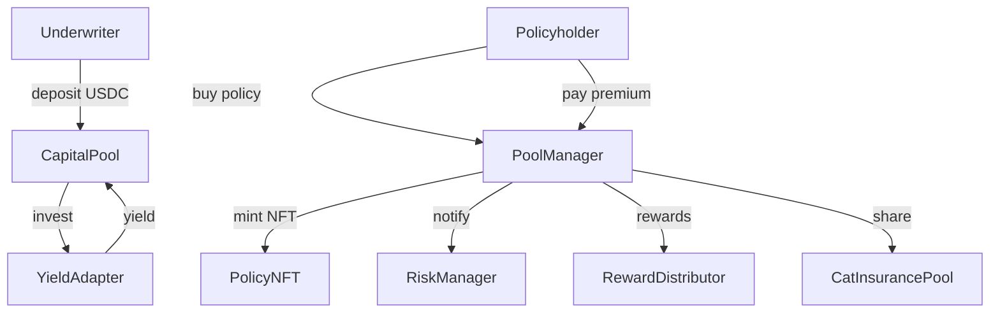
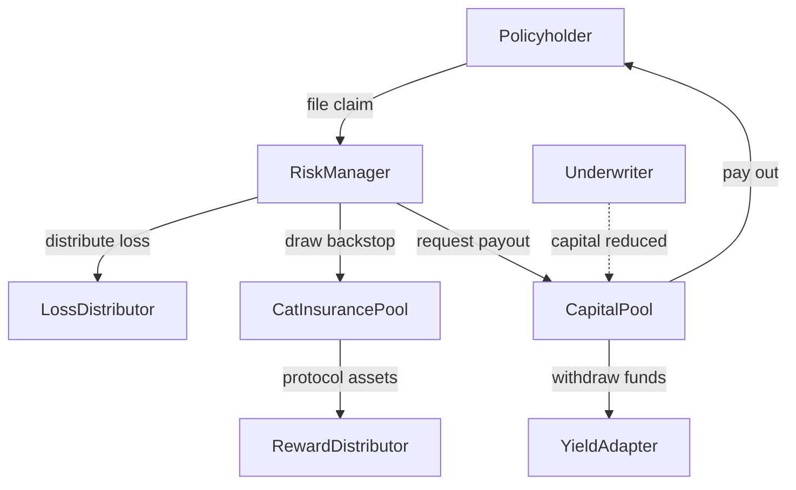

# CoverPool Contracts

This repository contains a Hardhat project implementing a prototype on‑chain insurance protocol.  The original monolithic **CoverPool** contract has been split into several modules.  `PolicyManager` handles policy purchases, `CapitalPool` tracks underwriter deposits, and `RiskManager` coordinates allocations and claims.  Policy positions are represented by NFTs and a separate **CatInsurancePool** still acts as an additional backstop fund.

## Directory Layout

```
contracts/               Solidity sources
├─ core/                 Core contracts
│  ├─ CapitalPool.sol       Underwriter vault and yield adapter hooks
│  ├─ PoolRegistry.sol      Registry of risk pools and rate models
│  ├─ PolicyManager.sol     User-facing policy lifecycle logic
│  └─ RiskManager.sol       Coordinates allocation, claims and payouts
├─ external/             Optional backstop modules
│  └─ CatInsurancePool.sol  Secondary pool funded by premiums
├─ governance/           DAO style governance
│  ├─ Committee.sol
│  └─ Staking.sol
├─ peripheral/           Loss and reward accounting helpers
│  ├─ LossDistributor.sol
│  └─ RewardDistributor.sol
├─ adapters/             Yield strategy implementations
│  ├─ AaveV3Adapter.sol
│  ├─ CompoundV3Adapter.sol
│  ├─ EulerAdapter.sol
│  ├─ MoonwellAdapter.sol
│  └─ MorhpoAdapter.sol
├─ tokens/               ERC20/721 tokens used by the protocol
│  ├─ CatShare.sol
│  ├─ PolicyNFT.sol
│  └─ oShare.sol
├─ oracles/              Price feeds
│  └─ PriceOracle.sol
├─ utils/                Misc utilities
│  └─ MulticallReader.sol
├─ interfaces/           Shared protocol interfaces
└─ test/                 Mock contracts for unit tests

frontend/                Next.js dApp for interacting with the contracts
scripts/                 Deployment and helper scripts
subgraphs/               The Graph subgraph definitions
test/                    JavaScript test suite
hardhat.config.js        Hardhat configuration
package.json             Project dependencies and scripts
```

## Requirements

- Node.js (>=18)
- npm (>=9)
- Network access to the npm registry

Install dependencies with:

```bash
npm install
```
You can also run Hardhat commands via `scripts/hardhat.sh` which
automatically installs dependencies if `node_modules` is missing.

## Usage

Compile contracts with:

```bash
npx hardhat compile
```

Run the test suite with:

```bash
npx hardhat test
```

Run Slither static analysis with:

```bash
npm run slither
```

Deploy the **PriceOracle** and register Chainlink feeds on Base with:

```bash
npx hardhat run scripts/deploy-oracle.js --network base
```

Then update `frontend/.env` using the printed `PriceOracle` and `MulticallReader`
addresses so the frontend can display token prices and batch queries.

The default network configuration uses Hardhat's in‑memory chain.  Modify `hardhat.config.ts` to add or customise networks. Running scripts on a remote network requires access to the configured RPC endpoint.

## Contracts Overview

- **CapitalPool** – Holds underwriter funds and interacts with yield adapters. Losses and withdrawals are accounted here.
- **PolicyManager** – User entrypoint for purchasing cover. Mints and burns `PolicyNFT` tokens.
- **RiskManager** – Coordinates pool allocations, claims processing and rewards through `LossDistributor` and `RewardDistributor`.
- **PoolRegistry** – Stores pool parameters, rate models and active adapters for each risk pool.
- **CatInsurancePool** – Collects a share of premiums and provides additional liquidity during large claims. Calling `setRewardDistributor` now configures the distributor's cat pool automatically so users can claim protocol asset rewards without extra setup.
- **Governance (Committee & Staking)** – Simple on‑chain governance used for pausing pools and slashing misbehaving stakers.

## Running a Local Node

To experiment with the contracts interactively you can start a local Hardhat node:

```bash
npx hardhat node
```

In a separate terminal deploy contracts and run scripts using the `--network localhost` option.

## Further Reading

The unit tests under `test/` demonstrate common interactions such as underwriting deposits, premium payments and withdrawals.  Examine `test/risk-manager.test.js` for detailed examples of calling the contracts.


## Frontend

A minimal Next.js project lives under `frontend/` for interacting with the contracts.
Install dependencies and run the development server with:

```bash
cd frontend
npm install
npm run dev
```

Environment variables such as the RPC endpoint and deployed contract addresses can
be configured in `.env` (see `.env.example`). If no addresses are provided the
frontend attempts to read `deployedAddresses.json` at the repository root,
written by the deployment scripts. At a minimum set
`NEXT_PUBLIC_POOL_MANAGER_ADDRESS` and `NEXT_PUBLIC_RISK_MANAGER_ADDRESS` so the
frontend knows where the core contracts live when no JSON file is present.
Several API routes under `app/api` demonstrate reading data from the contracts.
Examples
include:

- `GET /api/pools` – number of pools
- `GET /api/pools/list` – detailed info for all pools
- `GET /api/pools/[id]` – info and underwriters for a specific pool
- `GET /api/underwriters/[address]` – account details for an underwriter
- `GET /api/adapters` – active yield adapter addresses
- `GET /api/underwriters/[address]/allocated/[poolId]` – check an underwriter's pool allocation
- `GET /api/catpool/liquidusdc` – CatInsurancePool liquid USDC value
- `GET /api/catpool/rewards/[address]/[token]` – claimable distressed asset rewards
- `GET /api/policies/[id]` – fetch details for a Policy NFT

### Multiple Deployments

The frontend can aggregate contract data from several deployments. Set
`NEXT_PUBLIC_DEPLOYMENTS` in `.env` to a JSON array where each entry defines the
addresses and optional RPC/Subgraph endpoints for a deployment. When the
variable is not provided, the single address variables such as
`NEXT_PUBLIC_RISK_MANAGER_ADDRESS` are used instead.

Each deployment object supports the following keys:

- `name` – label reported in API responses
- `riskManager` – `RiskManager` contract address
- `capitalPool` – `CapitalPool` contract address
- `catPool` – `CatInsurancePool` contract address
- `priceOracle` – `PriceOracle` contract address
- `multicallReader` – `MulticallReader` contract address
- `lossDistributor` – `LossDistributor` contract address
- `rewardDistributor` – `RewardDistributor` contract address
- `rpcUrl` – RPC endpoint for read‑only queries
- `subgraphUrl` – GraphQL endpoint for the deployment's subgraph

Example:

```json
NEXT_PUBLIC_DEPLOYMENTS='[
  {
    "name": "base",
    "riskManager": "0xabc...",
    "capitalPool": "0xdef...",
    "catPool": "0xghi...",
    "lossDistributor": "0xlmn...",
    "rewardDistributor": "0xopq...",
    "priceOracle": "0xjkl...",
    "multicallReader": "0x123...",
    "rpcUrl": "https://base.publicnode.com",
    "subgraphUrl": "https://api.thegraph.com/subgraphs/name/project/base"
  },
  {
    "name": "optimism",
    "riskManager": "0x123...",
    "capitalPool": "0x456...",
    "catPool": "0x789...",
    "lossDistributor": "0xuvw...",
    "rewardDistributor": "0xyz...",
    "priceOracle": "0xabc...",
    "multicallReader": "0xdef...",
    "rpcUrl": "https://optimism.publicnode.com",
    "subgraphUrl": "https://api.thegraph.com/subgraphs/name/project/optimism"
  }
]'
```

The API routes iterate over each deployment, combining results so callers see a
single aggregated view across all configured deployments.

To provide defaults when `rpcUrl` or `subgraphUrl` are omitted you can also set
the server‑side `RPC_URL` and `SUBGRAPH_URL` variables in `.env`.

### Running Tests

Frontend unit tests use **Vitest** with React Testing Library:

```bash
cd frontend
npm run test
```

Subgraph mappings can be tested with **matchstick-as**:

```bash
cd subgraphs/insurance
npm run test
```

## License

This project is licensed under the **Business Source License 1.1**. See [LICENSE](./LICENSE) for details.

## Underwriter Capital Flow



## Distressed Capital Flow During Claims


