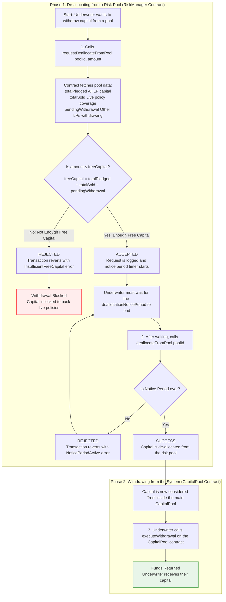
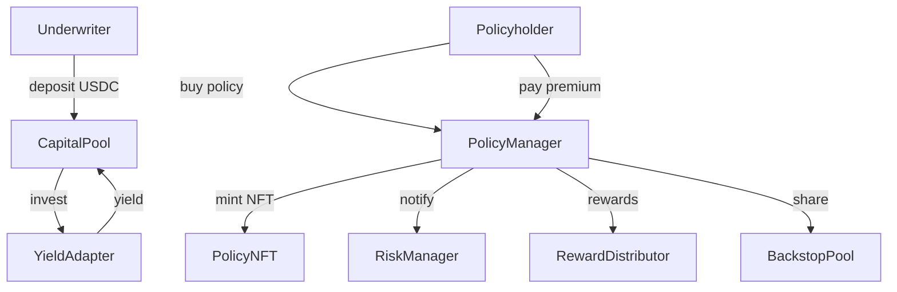

# CoverPool Contracts

Amplify Insurance is building a modular, open-source insurance marketplace where underwriters supply USDC liquidity, policy-holders buy cover on specific DeFi or real-world risks, and the whole life-cycle is enforced by Solidity smart-contracts. The code lives in a Hardhat monorepo; the `contracts/` package is the heart of the system, and all figures below refer to that codebase.

## Amplify Insurance’s on-chain cover protocol – high-level summary

### Core building blocks

- **CapitalPool** – a vault that accepts underwriter deposits, sends idle funds to external “yield adapters”, and keeps an accounting of profits, losses and withdrawal queues.
- **PolicyManager** – the single user-facing entry point: it mints an ERC-721 `PolicyNFT` for every policy sold, tracks premiums, and burns the NFT on expiry or claim.
- **RiskManager** – orchestrates the movement of funds between pools during allocations, premium collection and claim payouts, using the `LossDistributor` and `RewardDistributor` helpers for pro-rata maths.
- **PoolRegistry** – a registry where each “risk pool” lives with its utilisation-based premium curve, whitelist of accepted collateral and active yield adapter.

### Liquidity & premium flows

Underwriters deposit USDC → `CapitalPool` optionally stakes it in Aave, Compound, Euler, Moonwell or Morpho via plug-in adapters → yield flows back to the pool. When a policy-holder buys cover, `PolicyManager` pulls capital from the relevant risk pool, mints a `PolicyNFT` and streams premiums (block-by-block) back to underwriters. A small slice of every premium goes to the `BackstopPool` – a catastrophe back-stop fund issued as `CatShare` ERC-20 tokens. The README diagrams (“Underwriter Capital Flow” & “Distressed Capital Flow”) illustrate these paths in detail.


## Requirements

- Node.js (>=18)
- npm (>=9)
- Network access to the npm registry

Install dependencies with:

```bash
npm install
```
You can also run Hardhat commands via `scripts/hardhat.sh` which
automatically installs dependencies if `node_modules` is missing.


## Further Reading

The unit tests under `test/` demonstrate common interactions such as underwriting deposits, premium payments and withdrawals.  Examine `test/RiskManager.test.js` for detailed examples of calling the contracts.

See [frontend/README.md](./frontend/README.md) for instructions on running the dApp and available API routes.


## License

This project is licensed under the **Business Source License 1.1**. See [LICENSE](./LICENSE) for details.

## Underwriter Capital Flow






## Distressed Capital Flow During Claims


