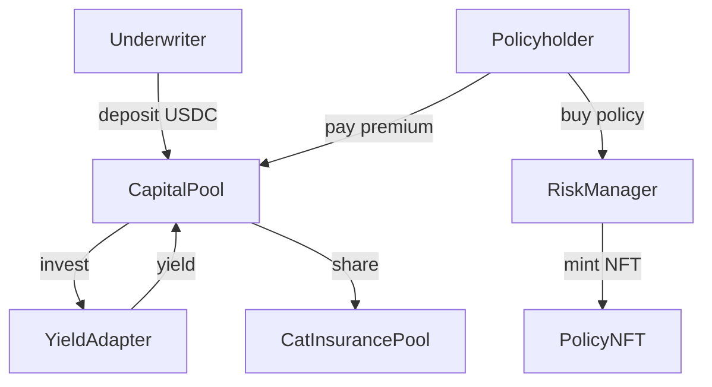
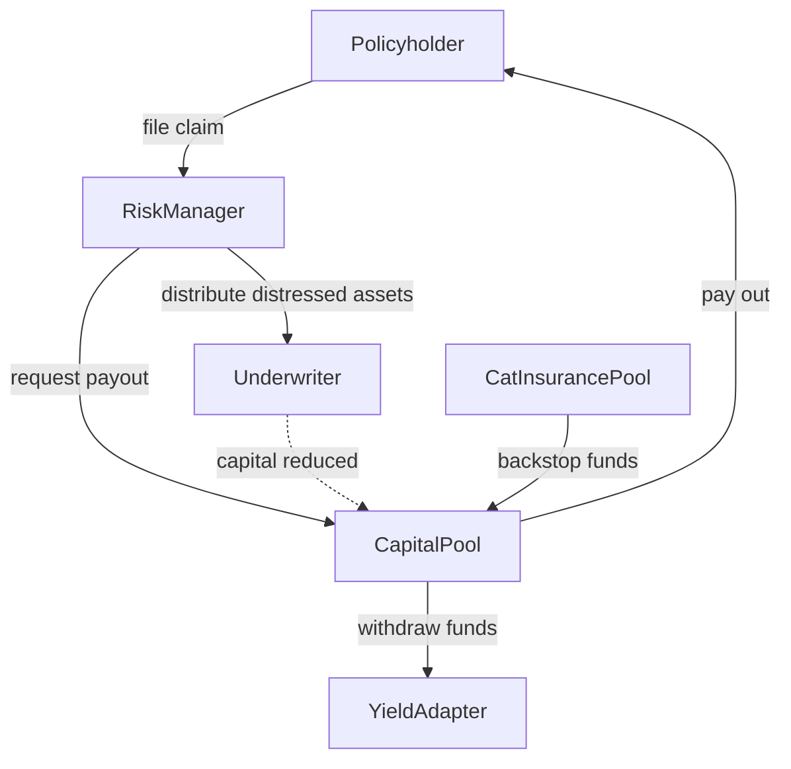

# CoverPool Contracts

This repository contains a Hardhat project implementing a prototype insurance system for on‑chain assets.  The project is centred around the **CoverPool** contract which allows underwriters to provide liquidity and sell cover for specific protocol risks.  Policy positions are represented by NFTs and a separate **CatInsurancePool** acts as an additional backstop fund.

## Directory Layout

```
contracts/               Solidity sources
├─ CapitalPool.sol       Vault that holds underwriter funds
├─ RiskManager.sol       Core logic for selling policies and applying claims
├─ CatInsurancePool.sol  Backstop pool funded by a share of premiums
├─ adapters/             Yield strategy implementations
│  ├─ AaveV3Adapter.sol
│  ├─ CompoundV3Adapter.sol
│  ├─ EulerAdapter.sol
│  ├─ MoonwellAdapter.sol
│  └─ MorhpoAdapter.sol
├─ tokenization/         ERC20/721 tokens used by the protocol
│  ├─ CatShare.sol
│  ├─ PolicyNFT.sol
│  └─ oShare.sol
├─ interfaces/           Shared protocol interfaces
│  ├─ IPolicyNFT.sol
│  ├─ ISdai.sol
│  └─ IYieldAdapter.sol
└─ test/                 Mock contracts for unit tests

frontend/                Next.js dApp for interacting with the contracts
scripts/                 Deployment and helper scripts
subgraphs/               The Graph subgraph definitions
test/                    JavaScript test suite
hardhat.config.js        Hardhat configuration
package.json             Project dependencies and scripts
```

## Requirements

- Node.js (>=18)
- npm

Install dependencies with:

```bash
npm install
```

## Usage

Compile contracts with:

```bash
npx hardhat compile
```

Run the test suite with:

```bash
npx hardhat test
```

Run Slither static analysis with:

```bash
npm run slither
```

Deploy the **PriceOracle** and register Chainlink feeds on Base with:

```bash
npx hardhat run scripts/deploy-oracle.js --network base
```

Then update `frontend/.env` using the printed `PriceOracle` address so the
frontend can display token prices.

The default network configuration uses Hardhat's in‑memory chain.  Modify `hardhat.config.ts` to add or customise networks.

## Contracts Overview

- **CoverPool** – Core contract where underwriters deposit stablecoins, allocate capital to specific risk pools and earn premium income.  Premiums are calculated using utilisation‑based rate models.  Claims burn policy NFTs and distribute losses among the relevant underwriters.  Optionally integrates with yield adapters for idle capital.
- **CatInsurancePool** – Collects a portion of premiums from `CoverPool` and can provide extra liquidity during large claims.  Liquidity providers receive `CatShare` tokens representing their share of the pool and can claim protocol assets recovered from claims.
- **PolicyNFT** – ERC721 that tracks each active policy.  Policies store coverage amount, associated risk pool and the timestamp of last paid premium.
- **Yield Adapters** – Contracts implementing `IYieldAdapter` allow depositing idle funds into external protocols (e.g. an sDAI adapter or mocks for testing).

## Running a Local Node

To experiment with the contracts interactively you can start a local Hardhat node:

```bash
npx hardhat node
```

In a separate terminal deploy contracts and run scripts using the `--network localhost` option.

## Further Reading

The unit tests under `test/` demonstrate common interactions such as underwriting deposits, premium payments and withdrawals.  Examine `test/CoverPool.test.js` for detailed examples of calling the contracts.


## Frontend

A minimal Next.js project lives under `frontend/` for interacting with the contracts.
Install dependencies and run the development server with:

```bash
cd frontend
npm install
npm run dev
```

Environment variables such as the RPC endpoint and deployed contract addresses can
be configured in `.env` (see `.env.example`). Several API routes under
`app/api` demonstrate reading data from the contracts. Examples
include:

- `GET /api/pools` – number of pools
- `GET /api/pools/list` – detailed info for all pools
- `GET /api/pools/[id]` – info and underwriters for a specific pool
- `GET /api/underwriters/[address]` – account details for an underwriter
- `GET /api/adapters` – active yield adapter addresses
- `GET /api/underwriters/[address]/allocated/[poolId]` – check an underwriter's pool allocation
- `GET /api/catpool/liquidusdc` – CatInsurancePool liquid USDC value
- `GET /api/catpool/rewards/[address]/[token]` – claimable distressed asset rewards
- `GET /api/policies/[id]` – fetch details for a Policy NFT

### Multiple Deployments

The frontend can aggregate contract data from several deployments. Set
`NEXT_PUBLIC_DEPLOYMENTS` in `.env` to a JSON array where each entry defines the
addresses and optional RPC/Subgraph endpoints for a deployment. When the
variable is not provided, the single address variables such as
`NEXT_PUBLIC_RISK_MANAGER_ADDRESS` are used instead.

Each deployment object supports the following keys:

- `name` – label reported in API responses
- `riskManager` – `RiskManager` contract address
- `capitalPool` – `CapitalPool` contract address
- `catPool` – `CatInsurancePool` contract address
- `priceOracle` – `PriceOracle` contract address
- `rpcUrl` – RPC endpoint for read‑only queries
- `subgraphUrl` – GraphQL endpoint for the deployment's subgraph

Example:

```json
NEXT_PUBLIC_DEPLOYMENTS='[
  {
    "name": "base",
    "riskManager": "0xabc...",
    "capitalPool": "0xdef...",
    "catPool": "0xghi...",
    "priceOracle": "0xjkl...",
    "rpcUrl": "https://base.publicnode.com",
    "subgraphUrl": "https://api.thegraph.com/subgraphs/name/project/base"
  },
  {
    "name": "optimism",
    "riskManager": "0x123...",
    "capitalPool": "0x456...",
    "catPool": "0x789...",
    "priceOracle": "0xabc...",
    "rpcUrl": "https://optimism.publicnode.com",
    "subgraphUrl": "https://api.thegraph.com/subgraphs/name/project/optimism"
  }
]'
```

The API routes iterate over each deployment, combining results so callers see a
single aggregated view across all configured deployments.

To provide defaults when `rpcUrl` or `subgraphUrl` are omitted you can also set
the server‑side `RPC_URL` and `SUBGRAPH_URL` variables in `.env`.

### Running Tests

Frontend unit tests use **Vitest** with React Testing Library:

```bash
cd frontend
npm run test
```

Subgraph mappings can be tested with **matchstick-as**:

```bash
cd subgraphs/insurance
npm run test
```

## License

This project is licensed under the **Business Source License 1.1**. See [LICENSE](./LICENSE) for details.

## Underwriter Capital Flow



## Distressed Capital Flow During Claims


